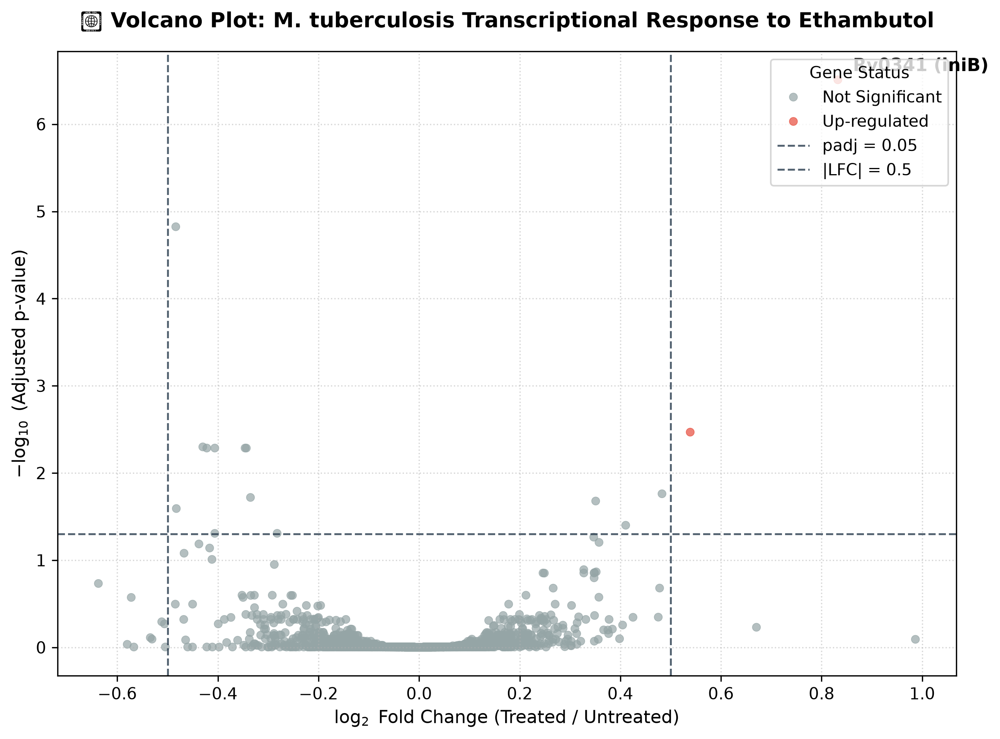
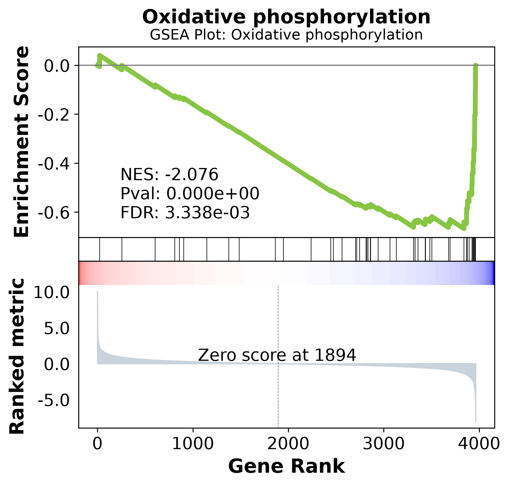
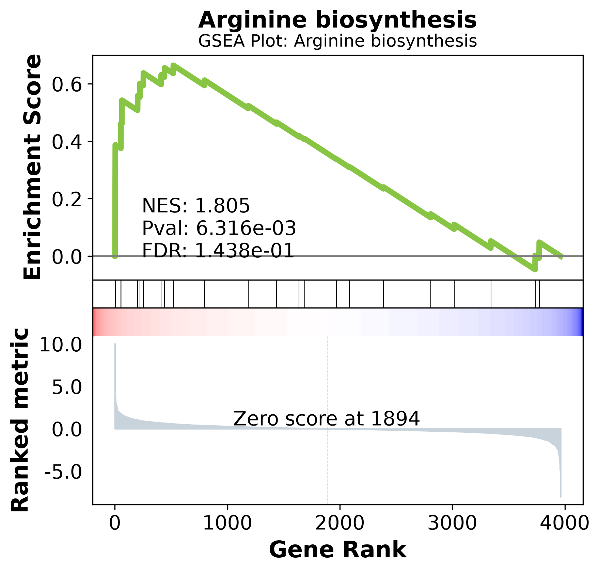

# 🧬 Mycobacterium tuberculosis RNA-Seq Analysis Pipeline

## 📌 Project Overview
This project presents an end-to-end transcriptomics data analysis pipeline focusing on the transcriptional response of *Mycobacterium tuberculosis* (H37Rv) to Ethambutol treatment. The workflow processes raw RNA-Seq data to identify Differentially Expressed Genes (DEGs) and perturbed biological pathways.

## 🛠️ Tools & Technologies Used
* **Environment & Scripting:** Python (Jupyter Notebooks), Bash, Conda.
* **Quality Control:** FastQC, MultiQC, Trimmomatic.
* **Alignment:** HISAT2, SAMtools.
* **Quantification:** featureCounts (Subread).
* **Differential Expression:** PyDESeq2.
* **Functional Enrichment:** GSEApy, KEGG API (Dynamic MTU pathways).
* **Visualization:** Matplotlib, Seaborn.

## 📂 Project Structure (Notebooks)
The analysis is divided into 6 systematic Jupyter Notebooks:
1. **`01_env_setup_and_data_download.ipynb`**: Conda environment creation and SRA data retrieval.
2. **`02_quality_control.ipynb`**: Assessing read quality and trimming adapters.
3. **`03_genome_alignment.ipynb`**: Mapping cleaned reads to the *M. tuberculosis* H37Rv reference genome using HISAT2.
4. **`04_gene_quantification.ipynb`**: Counting reads mapped to genomic features.
5. **`05_differential_expression.ipynb`**: Statistical analysis using PyDESeq2 to identify up- and down-regulated genes.
6. **`06_Functional_Enrichment_Analysis.ipynb`**: Preranked GSEA using dynamic KEGG pathway fetching for *M. tuberculosis*.

## 📊 Key Findings
* **Differential Expression:** Identified significant DEGs triggered by Ethambutol stress (e.g., strong upregulation of `Rv0341`/`iniB`).
* **Pathway Enrichment:** * 📉 **Down-regulated:** *Oxidative phosphorylation* and *Tuberculosis pathogenicity* (indicating metabolic slowdown and reduced virulence under stress).
  * 📈 **Up-regulated:** *Arginine biosynthesis* (a known stress-response and cell-wall repair mechanism in mycobacteria).

## 📈 Visual Results

### 1. Volcano Plot (Differential Expression)
Here is the Volcano plot showing the significantly Up-regulated and Down-regulated genes after Ethambutol treatment:
 

### 2. Hierarchical Clustering Heatmap
This heatmap displays the expression profiles of the top differentially expressed genes across all replicates, showing a clear distinction between Treated and Untreated samples:

### 3. GSEA Enrichment Plots
**Down-regulated Pathway: Oxidative Phosphorylation**

**Up-regulated Pathway: Arginine Biosynthesis**

